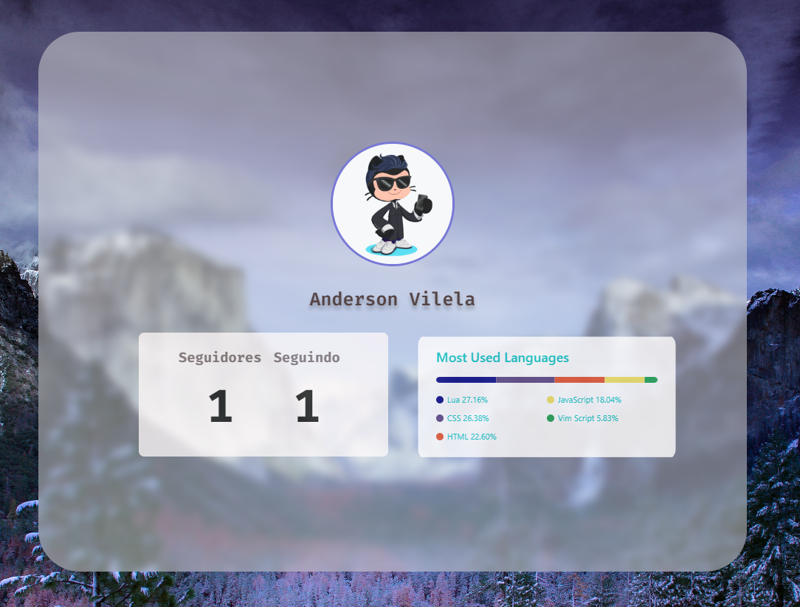

## Available Scripts

In the project directory, you can run:

### `npm start`

Para rodar o programa:
clone o projeto : $ git clone https://github.com/AndersonVilela/github-profile.git

entre na pasta :  $ cd github-profile 
rode: 

$ npm install react

$ npm start
Open [http://localhost:3000](http://localhost:3000) to view it in your browser.

### Mostrando um gif

### Página Incial cheia

### Página incial

### Depois de ter colocado o nome de usuário

